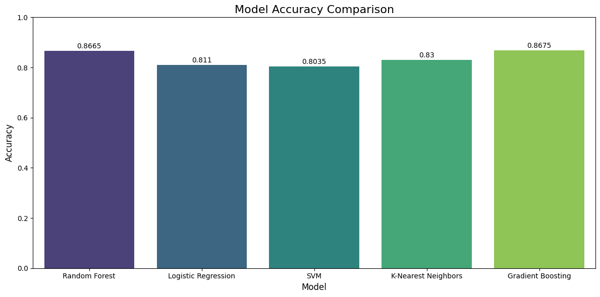

# Donor Churn Prediction Model Comparison

## Overview
This project explores the accuracy and performance of different machine learning models for predicting donor churn. It was inspired by a real world use case, a non-profit client requested an analysis to determine which predictive model would deliver the most accurate results for identifying donors at risk of churn.  

For demonstration purposes, this repo recreates the project using a test dataset. (https://www.kaggle.com/datasets/shrutimechlearn/churn-modelling/data)

---

## Business Case
Non-profit organisations rely on donor retention to sustain their operations. Accurately predicting donor churn allows organisations to proactively engage at risk donors and optimise fundraising efforts. This project evaluates multiple models to identify the best performing for donor churn prediction.

---

## Models Evaluated
The following machine learning models were compared

- Logistic Regression  
- Support Vector Machine (SVM)  
- K-Nearest Neighbors (KNN)  
- Random Forest  
- Gradient Boosting  

All models were evaluated using pre-computed metrics including accuracy, confusion matrix, and classification reports.

---

## Key Findings

### Accuracy Comparison
| Model                | Accuracy |
|----------------------|---------|
| Gradient Boosting     | 0.8675  |
| Random Forest         | 0.8665  |
| K-Nearest Neighbors   | 0.8300  |
| Logistic Regression   | 0.8110  |
| Support Vector Machine| 0.8035  |

- **Gradient Boosting** is the best performing model based on accuracy, closely followed by Random Forest.  
- A bar chart visually comparing model accuracies was generated to clearly show the performance hierarchy.

### Data Analysis Highlights
- Consolidated metrics including precision, recall, F1-score, and macro averages for all models were successfully compiled into a performance table.  
- Initial issues parsing multi word labels (e.g., "macro avg") from classification reports were resolved using refined regular expressions, ensuring all metrics were accurately captured.  

## Insights 
- **Top Models:** Gradient Boosting and Random Forest show similarly high performance.  
